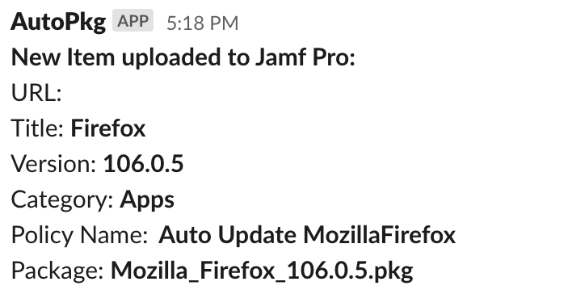
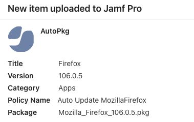

# AutoPkg Conductor

The `autopkg-conductor.sh` script is designed to do the following:

1. Detect a list of AutoPkg recipes at a defined location and verify that the list was readable.
2. If the AutoPkg recipe list was readable and available, run the following actions:

* Verify that AutoPkg is installed.
* Update all available AutoPkg repos with the latest recipes.
* Run the AutoPkg recipes in the list.

The AutoPkg run has all actions logged to `~/Library/Logs`, with the logfiles being named **autopkg-run-for-** followed by the date.

If the optional `slack_post_processor` and `slack_webhook` variables are correctly populated, AutoPkg recipes for Jamf Upload should have output sent to the Slack webhook specified in the `slack_webhook` variable.

If the optional `teams_post_processor` and `teams_webhook` variables are correctly populated, AutoPkg recipes for Jamf Upload should have output sent to the Microsoft Teams webhook specified in the `teams_webhook` variable.

Jamf Upload new package message for Slack:

Jamf Upload new package message for Teams:

For more information, please see the link below:

[https://derflounder.wordpress.com/category/autopkg-conductor/](https://derflounder.wordpress.com/category/autopkg-conductor/)